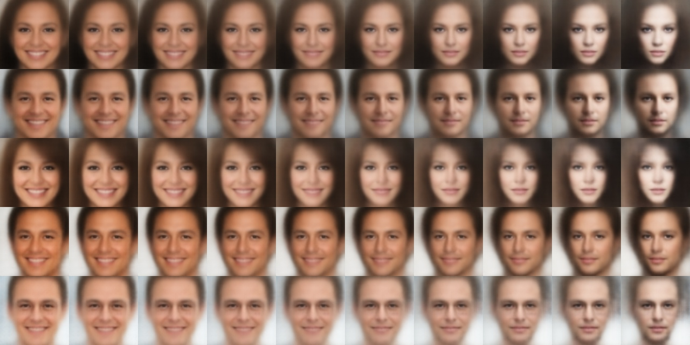
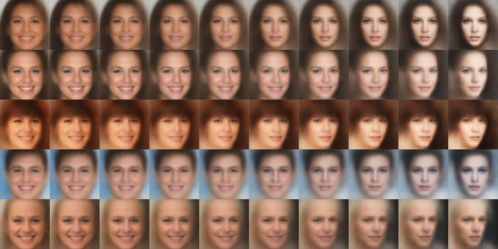
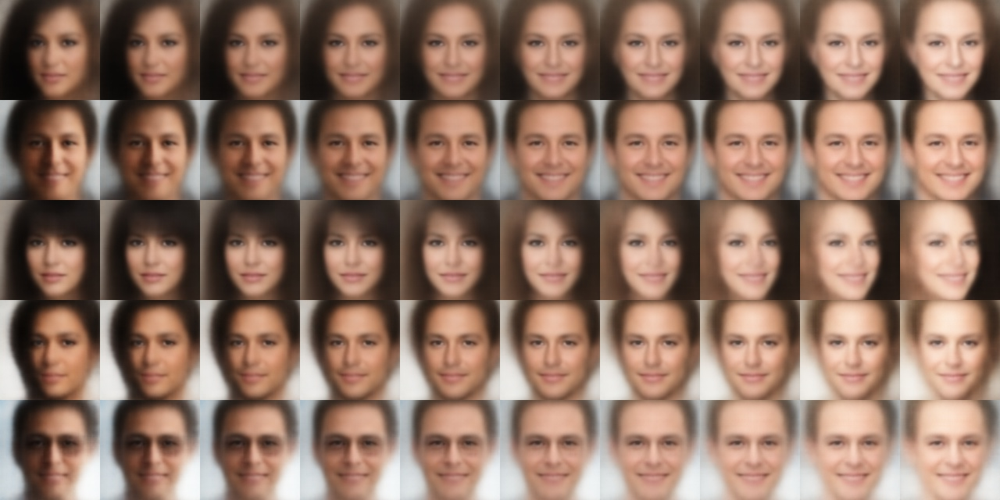
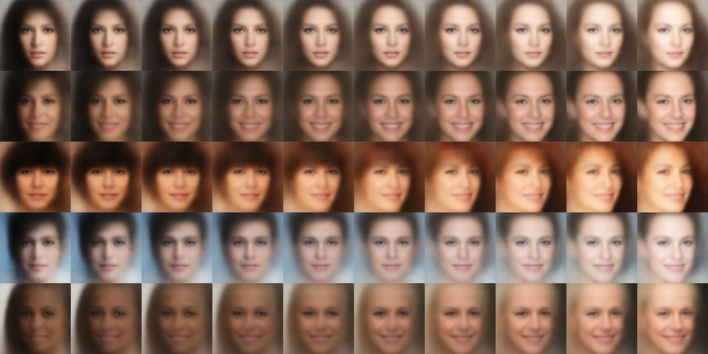
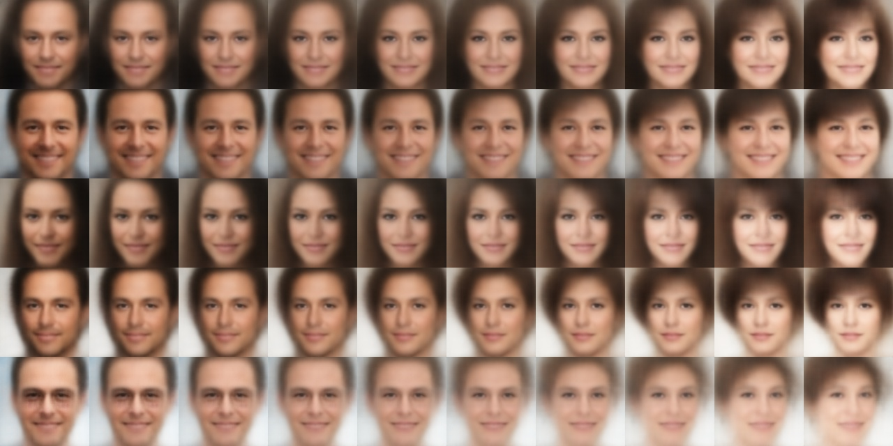
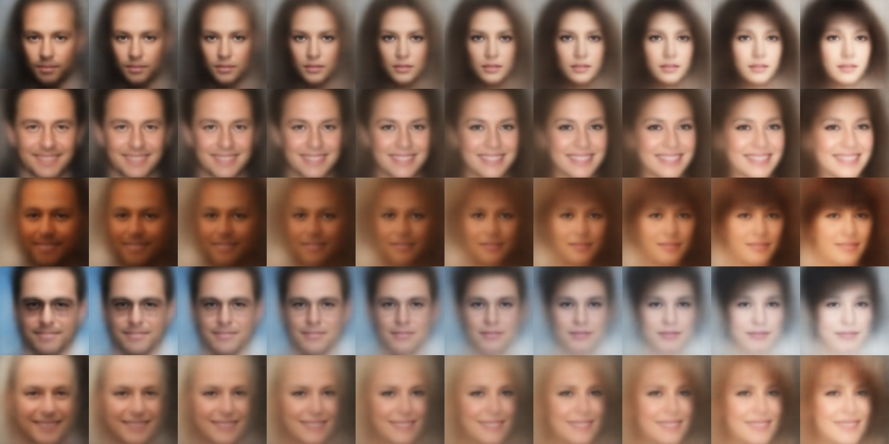
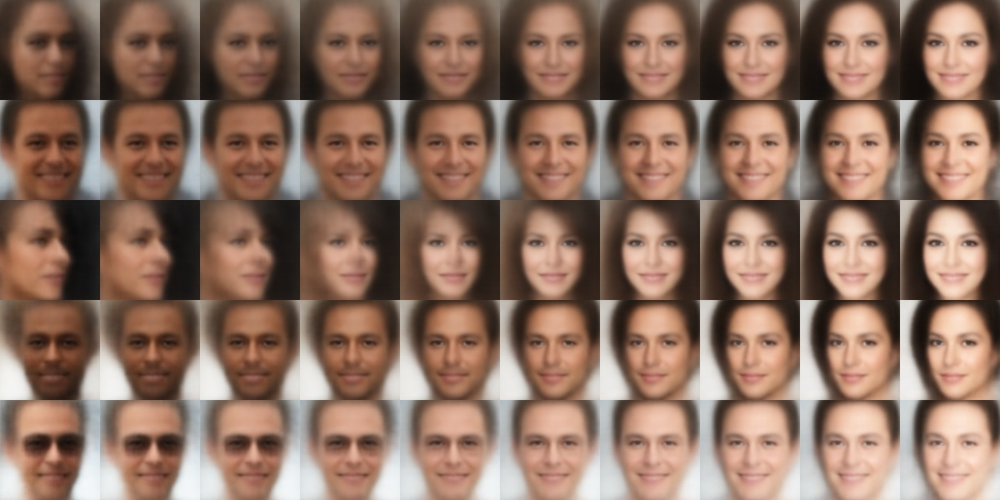
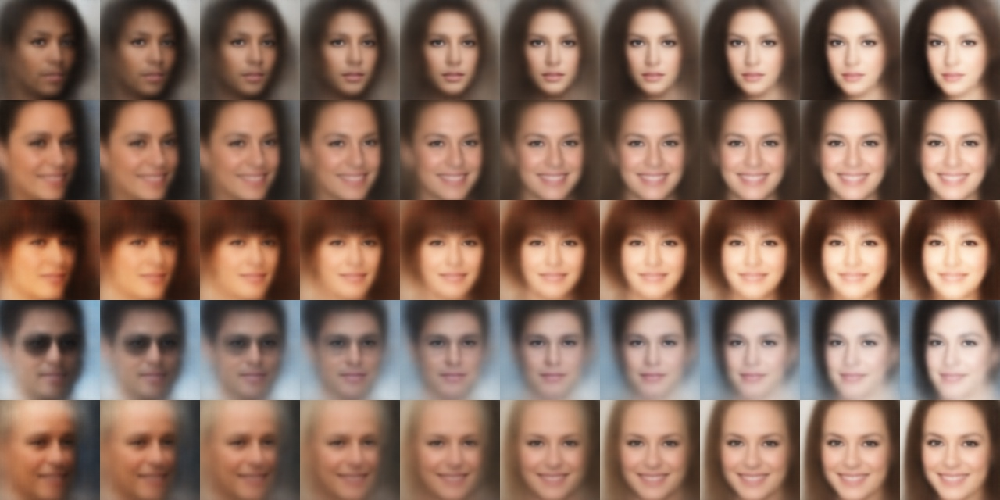

# Beta-VAE
Tensorflow implementation of Beta-Variational-AutoEncoder for CelebA dataset

This work is aimed to extract disentangled representations from CelebA image dataset using beta-variational-autoencoders.
For more on VAE's and Beta-VAE's refer these works:

1. [Auto-Encoding Variational Bayes](https://arxiv.org/pdf/1312.6114.pdf)
2. [Tutorial on Variational Autoencoders](https://arxiv.org/pdf/1606.05908.pdf)
3. [β-VAE: LEARNING BASIC VISUAL CONCEPTS WITH A CONSTRAINED VARIATIONAL FRAMEWORK](https://openreview.net/pdf?id=Sy2fzU9gl)
4. [Understanding disentangling in β-VAE](https://arxiv.org/pdf/1804.03599.pdf)

Code compatibility:
python>=3.6
Tensorflow==1.14.0

## Dataset

`python download_celebA.py 0B7EVK8r0v71pZjFTYXZWM3FlRnM CelebA.zip`

Extract CelebA.zip and the images are found in the img_align_celeba folder.

Data Processing:

All the images in the celeba dataset are of (218 ,178, 3) resolution and for this work all the images are cropped by carefully choosing the common face region (128, 128, 3) in all the images. Check data_crop in config.py

## Usage

For training:
`python vae.py --train`

For generating new samples:
`python vae.py --generate`

For latent space traversal:
`python vae.py --traverse`

# Results

Disentanglement obtained by carefully tuning beta-norm(βnorm). As this work is completely unsupervised visual inspection of latent space traversal showed best disentangled representations at βnorm = 0.7(kl_weight in config.py).

Following are the latent space traversal images obtained by fixing a particular dimension of latent vector and interpolating that dimension in the range [-3.0, 3.0]  for 5 randomly chosen seed latent vectors. It can be observed that Beta-VAE discovered latent generating factors such as Smile, Facial brightness, Baldness and others.

## Smile:
Left to right smiling face to serious look

Seed1:

Seed2:

## Facial Brightness:
Increase of facial brightness can be observed from left to right

Seed1:

Seed2:

## Baldness:
Hair transition can be observed from left to right

Seed1:

Seed2:

## Skin Tone:
Transition of skin tone can be observed from left to right

Seed1:

Seed2:

